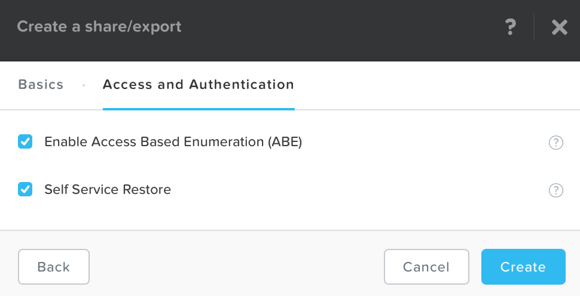
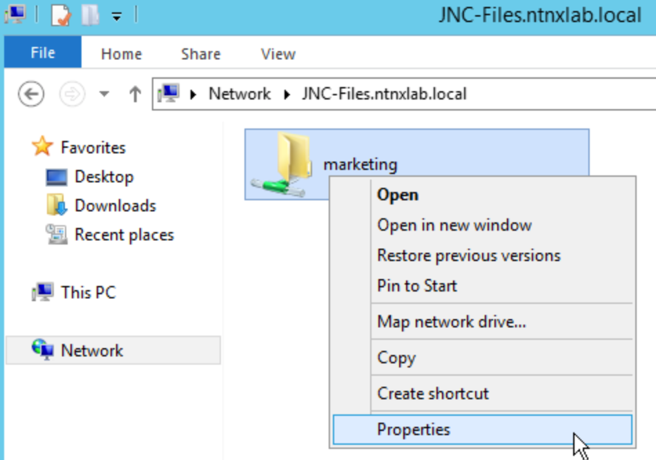
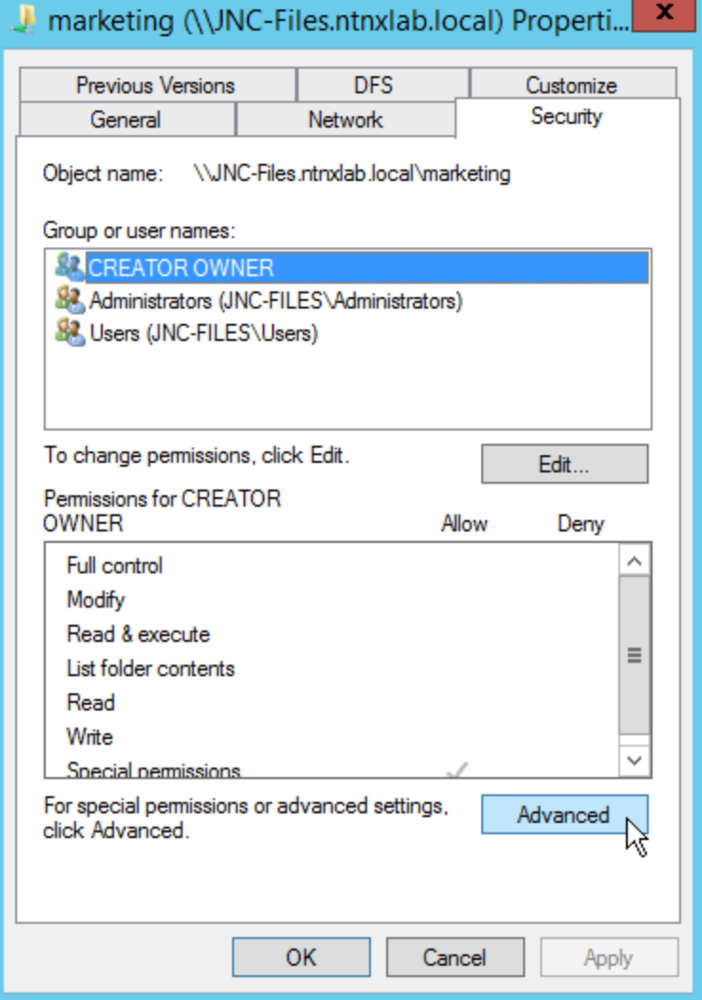
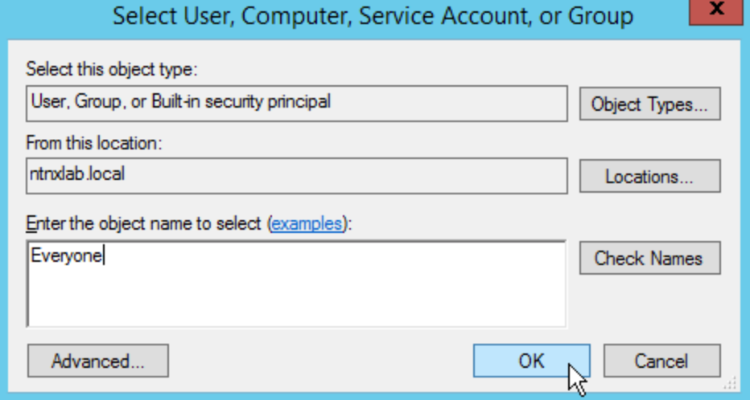
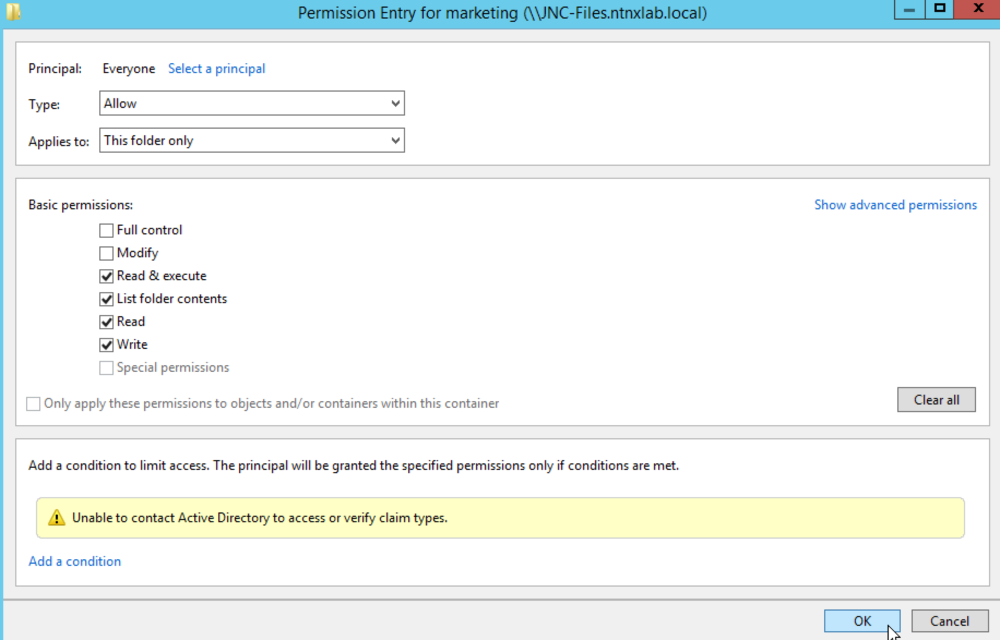
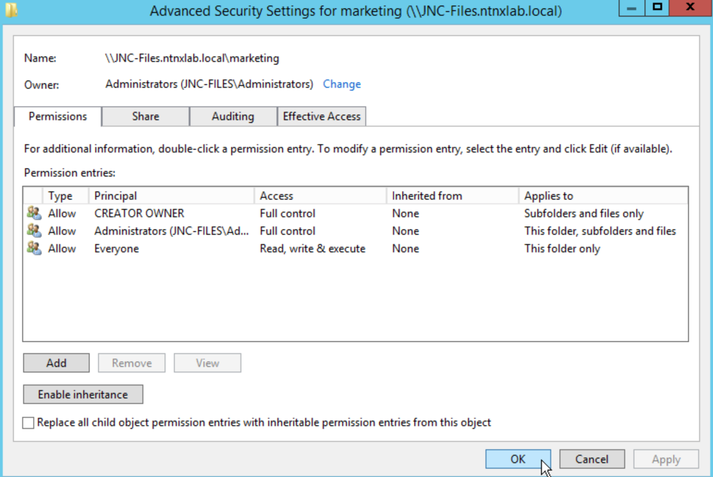
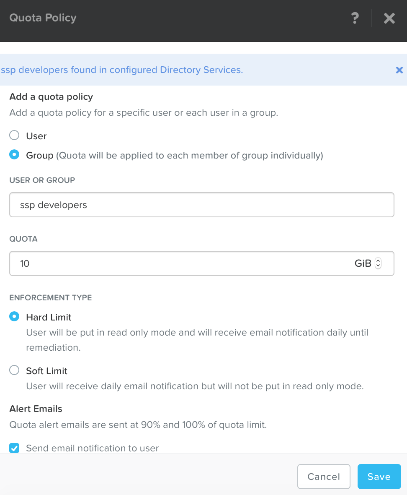

.. _files_smb_share:

----------------------------
Files: Create SMB Share (Windows)
----------------------------

Overview
++++++++

.. note::

  This Lab is for **Windows Virtual Machines**

  Ask the Instructor for the name of the File Server, as it has already been created for you.

  Locate one of your Windows VM's, open the console and join the machine to the NTNXLAB.local domain.

In this exercise you will use Files to configure an SMB share.

Join the Domain
+++++++++++++++++++

On the Windows VM you created previously, open the console and join the machine to the NTNXLAB.local domain. Use the below credentials to do so:

- **Username** - Administrator
- **Password** - nutanix/4u

Configuring SMB Home Share
+++++++++++++++++++

In **Prism > File Server**, click **+ Share/Export**. Fill out the following fields and click **Next**:

- **Name** - marketing-*intials*
- **Protocol** - SMB
- **Share/Export Type** - General Purpose Share

.. figure:: images/files_smb_001.png

Select **Enable Access Based Enumeration** and **Self Service Restore** and click **Create**.

Connect to SMB Share
+++++++++++++++++++

.. note::

  You can use any Windows VM joined to the ntnxlab.local domain to complete the following steps.

  The instructor may have a different **File Server** Name. If so, see the whiteboard.

Log into your Windows VM console, and open ``\\*fileservername*.ntnxlab.local\`` in **File Explorer**.

Right-click **marketing > Properties**.

Select the **Security** tab and click **Advanced**.

Select **Users** and click **Remove**.

Click **Add**.

Click **Select a principal** and specify **Everyone** in the **Object Name** field. Click **OK**.

Fill out the following fields and click **OK**:

- **Type** - Allow
- **Applies to** - This folder only
- Select **Read & execute**
- Select **List folder contents**
- Select **Read**
- Select **Write**

Click **OK > OK > OK**.

In **Prism > File Server > Share > marketing**, click **+ Add Quota Policy**. Fill out the following fields and click **Save**:

- Select **Groups**
- **Users or Group** - SSP Developers
- **Quota** - 10 GiB
- **Enforcement Type** - Hard Limit

Takeaways
+++++++++

- In this lab, you quickly utilized Nutanix Files to create a Shared Directory, and administer it via Windows Explorer.
